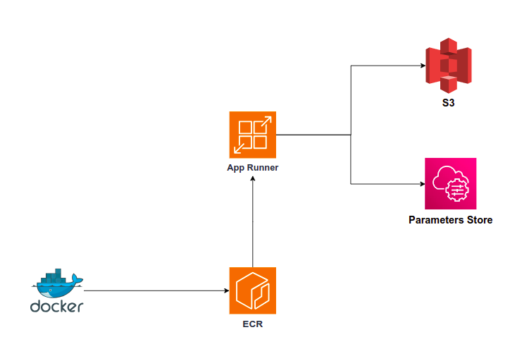

# Irius Risk Challenge

## Application Code

Under the "src" directory, we have the application code that will offer, through FastAPI, an endpoint to receive data, analyze it, and store the result in an S3 bucket on AWS.

Under "utils," there’s a module containing the necessary code to:

- Analyze the received text and count the most frequently occurring words
- Generate the result in JSON format and upload it to an S3 bucket

To upload the processing result to the S3 bucket, the Python library boto3 is used. Access credentials will be set as environment variables and obtained accordingly.

The "src" directory also contains the requirements.txt file with all necessary dependencies for our app.

## Docker Image Creation

This application will be containerized using Podman. In the root directory, there is a `Dockerfile` file with the necessary instructions to create the OCI image.

## Infrastructure as Code

To deploy our application, we will need certain infrastructure. We will use AWS as the cloud provider. The resources we will need are the following:

- **S3 Bucket**: To store the result of processing the data received as a parameter.
- **ECR (Elastic Container Registry)**: To store the Docker image of our application, which will later be deployed using AWS App Runner.
- **Parameter Store**: To store the access credentials that allow us to write the result to S3.

The necessary code is located under the `terraform` folder. Before applying it, some variables need to be defined. We will need to create the `terraform/terraform.tfvars` file with the following variables and their appropriate values.

```
app_name = "irius-challenge"
aws_access_key_id = "AKI*************5N"
aws_secret_access_key = "dGjo*********************AHP"
region_name = "eu-west-3"
```

To create the infrastructure, we will need to run the following commands:
   
```bash
cd terraform
terraform init
terraform apply
```

Once the Terraform execution is complete, we will have created the necessary resources in AWS to deploy our application.



## Docker Image Creation

In the `scripts` directory, we have everything needed to build and publish the Docker image and to create the service in AWS App Runner.

Before creating and publishing the Docker image, we need to review the file `scripts/variables.env` and modify the values according to our environment. We must ensure that the values given to `REGION_NAME` and `APP_NAME` align with the values in the `terraform.tfvars` file.

We also need to make sure that we have `aws` client properly installed and configured on our local environment.

Once the `scripts/variables.env` file has been reviewed and modified, we can create and publish the Docker image by running the following commands:

```
chmod +x ./scripts/build.sh 
./scripts/build.sh
```

This will have our application ready in ECR for deployment.

## Application Deployment

To deploy the application, we will use another shell script located in the `src` directory. In this case, it is the file `scripts/deploy.sh`.

It is enough to run the following command to deploy our application as a service in AWS App Runner:

```
chmod +x ./scripts/deploy.sh
./scripts/deploy.sh
```